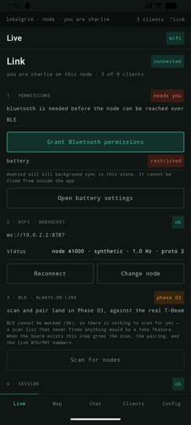

# lokalgrid

**A shared field node.** One LilyGO T-Beam Supreme serves live position, a map
and chat to a small group of phones over its own WiFi and BLE — no internet, no
server, no cell coverage. LoRa is the link *out* when WiFi range runs out.

The interesting part is not the tracker. It is that **one radio serves up to nine
clients**, so airtime has to be arbitrated: priority lanes, deficit round-robin,
a 1% duty cycle enforced in firmware, and a queue whose state is shown as a
*reason* — "queued 56 s, bravo ahead of you" — never a spinner. That, and the
rule that **every rendered position carries its uncertainty**: an accuracy ring
from HDOP, dashed interpolated segments, an age label on a stale fix. Never a
crisp dot implying precision the GNSS did not deliver.

Personal hobby build. Success is staying interesting, not shipping.

---

## State of play

| | |
|---|---|
| **Phase 00** — mock node + golden vectors | done |
| **Phase 01** — app against the mock, dot on the map | done |
| **Phase 02** — multi-client: chat, forward flow, cursors | in progress |
| **Phase 03** — the board comes out, BLE for real | not started · **natural stopping point** |
| 04–07 — scheduler hardening, codegen, LoRa, background sync | later, optional |

The roadmap is **mock-first**: the whole app is built against a ~500-line mock
node speaking the real wire protocol, so the T-Beam stays in its box until
Phase 03. Everything except the BLE GATT path can be developed with no hardware.

**Working today**, entirely against the mock: five tabs (Live · Map · Chat ·
Clients · Config), a live dot with its accuracy ring on a MapLibre map, one
shared chat channel with lane-0 emergency, position sharing with distance
decimation, roster and rename, node-computed airtime meters, staged-then-explicit
config writes, per-client cursors with backlog resume, a Link screen, and a
first-run flow (permissions · battery · node URL).

| | | | |
|---|---|---|---|
|  |  |  |  |
| **Live** — fix, uncertainty, people, cursor | **Map** — everyone, each with its ring and age | **Chat** — delivered *and* the link-out queue reason | **Link** — permissions · wifi · ble · session |

All twelve screens, and what changed between wireframe and build, are in
[§07 of the master plan](lokalgrid-master-plan.html) · raw files in
[`docs/screens/`](docs/screens).

## Run it

```bash
# 1. the fake node — synthetic track at 1 Hz, plus two wandering peers
cd mock-node && npm install && npm start -- --ghosts 2

# 2. the app, on an emulator (10.0.2.2 is its alias for your machine)
cd android && ./gradlew :app:installDebug
```

On a real phone, set the URL in the app's setup step to your machine's LAN IP —
`10.0.2.2` only resolves on an emulator. Tests need neither device nor board:

```bash
cd mock-node && npm test        # codec, airtime queue, config, decimation
cd android  && ./gradlew :protocol:test   # the Kotlin half of the same codec
```

## Layout

| Path | What |
|---|---|
| `PROJECT.md` | **The decision record.** Binding constraints, rejected ideas and why, the wire format, the roadmap. Read this first. |
| `lokalgrid-master-plan.html` | The same content rendered, with wireframes and the concept-rethink record. |
| `BUILDLOG.md` | Dated entry per session: what was tried, what surprised, what's next. Hobby projects die from lost context, not difficulty. |
| `mock-node/` | The fake node (Node.js). Serves the real protocol from a synthetic or replayed session. The highest-leverage code in the project. |
| `android/` | The client. `:protocol` is plain-Kotlin (codec + control frames, JVM-testable); `:app` is Compose + MapLibre. |
| `firmware/` | ESP-IDF skeleton — partitions, sdkconfig, LittleFS mount. Parked until Phase 03. |
| `schema/` | Empty until Phase 05, when hand-written codecs have drifted and codegen earns its place. |

## The wire

Positions are a **32-byte fixed-width little-endian record** — `offset = index * 32`,
so seeking is arithmetic rather than parsing. The layout never shrinks per build;
absent sensors write sentinels. Everything else (hello, roster, chat, queue state,
config, stats, refusals) is one JSON object per text frame, in both directions,
until protobuf arrives at Phase 05.

The codec is **hand-written twice on purpose** — JS on the node, Kotlin in the app
— cross-checked against a shared golden-vector fixture. When they eventually
disagree, that drift bug is the trigger for codegen. Full field table in
PROJECT.md §4; frame-by-frame protocol in `mock-node/README.md`.

## Hardware

LilyGO T-Beam Supreme (ESP32-S3, SX1262 LoRa, L76K GNSS, AXP2101 PMU, QMI8658
IMU, 1.3" OLED). Two rules that matter before anything else:

- **Never transmit without an antenna** — every hardware-damage path runs through
  the SX1262 PA.
- **The LoRa band is unconfirmed** (433 vs 868). Read the silkscreen before buying
  an antenna; a mismatched whip degrades the PA over weeks and reads exactly like
  a firmware bug. Does not block Phases 00–03, which use no LoRa.

## Conventions

- Client identities are **NATO callsigns** (`alpha`, `bravo`, `charlie`, …), never
  personal names — in code, tests, docs and wireframes alike.
- Failure states name the failure and offer the next action. Nothing is dropped
  silently; a refusal always carries a reason worth rendering.
- Commit the broken state with a log note. Stop at a milestone, not mid-refactor.
