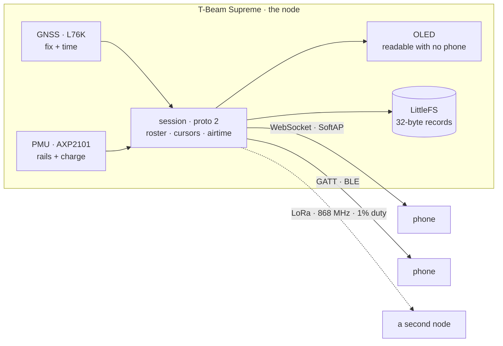

<h1 align="center">lokalgrid</h1>

<p align="center">
  <strong>A shared field node. One board serves live position, a map and chat to a group of phones — over its own WiFi and BLE.</strong><br>
  No internet. No server. No cell coverage. LoRa is the link <em>out</em> when WiFi range runs out.
</p>

<p align="center">
  
  
  
  
</p>

<p align="center">
  
  
  
  
  
</p>

<p align="center">
  
  
  
  
  <br>
  <sub>Boot · Live · Map · Chat · Link. The same app runs against the real board over BLE and WiFi — these are captured against the mock node, where the map is Greenwich and the peers are <code>alpha</code> and <code>bravo</code>.</sub>
</p>

---

The interesting part is not the tracker. It is that **one radio serves up to nine
clients**, so airtime has to be arbitrated: priority lanes, deficit round-robin,
a 1% duty cycle enforced in firmware, and a queue whose state is shown as a
*reason* — "queued 56 s, bravo ahead of you" — never a spinner. That, and the
rule that **every rendered position carries its uncertainty**: an accuracy ring
from HDOP, dashed interpolated segments, an age label on a stale fix. Never a
crisp dot implying precision the GNSS did not deliver.

Personal hobby build. Success is staying interesting, not shipping.

---

## The node

**LilyGO T-Beam Supreme** — ESP32-S3, SX1262 LoRa, L76K GNSS, AXP2101 PMU, 1.3"
OLED, BME280, PCF8563 RTC — running ESP-IDF v5.3 firmware from `firmware/`.

> [!WARNING]
> **Never transmit without an antenna.** Every hardware-damage path on this board
> runs through the SX1262 PA. Nothing in the firmware transmits yet, which is the
> cheap way to keep that rule.
>
> **The band is 868**, and here it is kept inside **865–867 MHz** — India's
> delicensed ISM allocation, not the full EU 868 range, part of which is licensed.
> Confirm `868M` on the silkscreen beside the SMA connector before the first
> transmission: a mismatched whip degrades the PA over weeks and reads exactly
> like a firmware bug.

### What runs on it today

Boot **inventories both I²C buses and names every chip that answers**, a step
that has since paid for itself several times over. The PMU is read before
anything is written to it, so the rail map is known rather than assumed —
**ALDO4 turns out to be the GNSS rail**, and switching it on is what produced
the first NMEA sentence. The receiver was never dead, it was unpowered. On this
board a silent peripheral is a power question before it is a pin question.

| | |
|---|---|
| **GNSS** | Real fixes, GGA/RMC/GSA parsed into the 32-byte record — position, satellites, HDOP, altitude, speed, course, 2D/3D |
| **OLED** | Inverted header badged with clients-against-cap, then ssid · wifi · ble (clients + MTU) · gnss (satellites + HDOP, or the age of a lost fix) · power with uptime |
| **BLE** | Advertising with a GATT service; control and record characteristics in the §4 chunk framing |
| **WiFi** | SoftAP serving `proto 2` at `ws://192.168.4.1/ws` |
| **Storage** | LittleFS mounted, one task owning it |

`hello.mode` reports `gnss` or `synthetic`, so a demo track can never quietly
pass itself off as a position.

### What the datasheets got wrong

Three things, all found in the first five minutes of running real firmware
rather than by reading:

- **PSRAM is quad, not octal.** Octal boot-loops.
- **There are two I²C buses**, and the PMU and RTC live on the second one.
- **No QMI8658 is fitted**, so the motion gate falls back to GNSS speed.

The BME280 *is* fitted, though it is not read yet — `baro` and `tmp` still write
sentinels until it is. And the board runs from **USB, not a cell**, so there is
no battery percentage to report and the power ladder has nothing to measure.
Both say so rather than inventing a number.

### Proven on real hardware

Not a simulation, and not one phone. **Two handsets have been on this board at
once** — over **BLE** and over **WiFi**, at the same time — with the node
holding both in one roster and naming each client's transport. Scan, connect,
MTU negotiation, subscribe, join, backlog, live records and chat all run end to
end against the real T-Beam, on both wires.

That is the claim the whole design rests on: `proto 2` lives once in
`session.c`, and a client is a client whichever wire it arrived on. Two phones
on two different transports sharing one roster is what actually demonstrates it.

Still on the bench: a breakpoint over the built-in USB-JTAG, which is the sort
of thing to arrange before it is needed rather than after three days of
`printf`, and reading the BME280 so `baro` and `tmp` carry values.

---

## The app

Native **Android** — Kotlin and Compose, in `android/`. Five tabs, flat:
**Live · Map · Chat · Clients · Config**, with Diagnostics behind a long-press
on the title rather than a sixth tab.

- **A live dot with its accuracy ring** on a MapLibre map, everyone at once
- **One shared chat channel**, with a lane-0 emergency
- **The phone's own GNSS** behind "share my position" — with the node's fix as a
  *labelled* fallback, so a position never travels under a source nobody stated
- **Per-client cursors** with backlog resume; roster and rename
- **Staged-then-explicit** config writes — never a silent reconfigure mid-edit
- **Two basemaps** with an explicit offline download that states tile count and
  rough size *before* it starts
- **Sockets pinned to the WiFi network**, so Android's mobile-data fallback
  cannot steal the session, reconnecting by themselves with bounded backoff
- **A BLE transport** carrying the same session as the WebSocket — both verified
  against the real board, with two phones connected at once

Nothing is gated behind a live connection. Every tab stays readable offline, and
reconnecting resumes from the cursor.

<p align="center">
  
  
  
  <br>
  <sub>Clients · Config · Diagnostics · Setup. All twelve screens live in <a href="docs/screens">docs/screens/</a>.</sub>
</p>

> Recaptured 2026-08-01 against the mock node (`npm start -- --ghosts 2`), on a
> 1344×2992 emulator. Ten of the twelve are current; **`01-boot` and
> `08-diagnostics` are still from 2026-07-25** — the boot screen resolves in
> about a second, which is the point of it, and neither has changed. The map is
> the mock's neutral default start position, Greenwich, and the ghosts are
> `alpha` and `bravo`: no real location and no real name appears in any of them.

---

## How it works



The **node is authoritative about what exists** — seq, roster, admission — and
each **client is authoritative about what it has received**, its cursor. Neither
infers the other's state; it asks. Almost every duplicate-record bug in this
class of system is a violation of that one rule.

`proto 2` lives **once**, in `firmware/main/session.c`, behind a transport
interface. The WebSocket and BLE GATT adapters are thin. A client is a client
whichever wire it arrived on — one roster, one cap of nine, and the roster names
each client's transport.

---

## Tech stack

| Layer | Technology |
|---|---|
| **MCU** | [ESP-IDF](https://docs.espressif.com/projects/esp-idf/) v5.3 + CMake directly — not Arduino, not PlatformIO |
| **BLE** | [NimBLE](https://mynewt.apache.org/latest/network/) — GATT service + GAP, 9 concurrent connections |
| **Radio** | SX1262 via [RadioLib](https://github.com/jgromes/RadioLib) as an IDF component, duty cycle enforced in firmware |
| **Node storage** | [`esp_littlefs`](https://github.com/joltwallet/esp_littlefs) — power-loss safe, one owning task |
| **Node web** | `esp_http_server` with built-in WebSocket support |
| **App** | [Kotlin](https://kotlinlang.org/) + [Jetpack Compose](https://developer.android.com/compose), 64-bit only |
| **Map** | [MapLibre Android](https://maplibre.org/) + PMTiles, 16 KB page-aligned |
| **App store** | [Room](https://developer.android.com/training/data-storage/room) (SQLite) — the durable copy lives on the phone |
| **Mock node** | Node.js, ~500 lines, serving the real protocol from a synthetic or replayed session |

---

## The wire

Positions are a **32-byte fixed-width little-endian record** — `offset = index * 32`,
so seeking is arithmetic rather than parsing. The layout never shrinks per build;
absent sensors write sentinels. Everything else — hello, roster, chat, queue
state, config, stats, refusals — is one JSON object per text frame, in both
directions. Protobuf replaces the JSON later, once there is a reason.

The codec is **hand-written three times on purpose**: JS in the mock, Kotlin in
the app, C on the node, cross-checked against a shared golden-vector fixture
that all three reproduce byte for byte. When they eventually disagree, that
drift bug is the trigger for codegen — writing it three times is how you earn
the right to generate it.

Full field table in [PROJECT.md §4](PROJECT.md); frame-by-frame protocol in
[`mock-node/README.md`](mock-node/README.md).

---

## Run it

**Against the mock**, no hardware needed:

```bash
# 1. the fake node — synthetic track at 1 Hz, plus two wandering peers
cd mock-node && npm install && npm start -- --ghosts 2

# 2. the app, on an emulator (10.0.2.2 is its alias for your machine)
cd android && ./gradlew :app:installDebug
```

On a real phone, set the URL in the app's setup step to your machine's LAN IP —
`10.0.2.2` only resolves on an emulator.

**Against the board:**

```bash
cd firmware && idf.py -p /dev/cu.usbmodem* flash
```

Then either join the node's `lokalgrid` WiFi and point the app at
`ws://192.168.4.1/ws`, or — better — leave the phone on its normal WiFi and use
**BLE**: tap the status bar → Link → *Scan for nodes*. The node's AP has no
internet behind it, so joining it costs you the internet; BLE carries the same
session and does not.

> [!TIP]
> Reading the console on macOS has a trap worth knowing before it costs you an
> hour: `cat /dev/cu.usbmodem*` returns **zero bytes**. The USB-Serial-JTAG
> console only emits once the host CDC looks connected, and the `cu.` device
> deliberately does not assert modem control. Open the port and assert DTR and
> RTS together.

Tests need neither device nor board:

```bash
cd mock-node && npm test                  # codec, airtime queue, config, decimation
cd android   && ./gradlew :protocol:test  # the Kotlin half of the same codec
```

---

## Layout

| Path | What |
|---|---|
| [`PROJECT.md`](PROJECT.md) | **The decision record.** Binding constraints, rejected ideas and why, the wire format, the roadmap. Read this first. |
| [`lokalgrid-master-plan.html`](lokalgrid-master-plan.html) | **The reference spec** — hardware, app, and the protocol where they meet, plus what runs today. Current material only; start a coding session here. |
| [`BUILDLOG.md`](BUILDLOG.md) | Dated entry per session: what was tried, what surprised, what's next. Hobby projects die from lost context, not difficulty. |
| [`firmware/`](firmware) | The node. Board bring-up, PMU, GNSS, OLED, LittleFS, and `proto 2` served over both a WebSocket and BLE GATT from one transport-agnostic session. |
| [`android/`](android) | The client. `:protocol` is plain-Kotlin (codec + control frames, JVM-testable); `:app` is Compose + MapLibre. |
| [`mock-node/`](mock-node) | The fake node. Serves the real protocol from a synthetic or replayed session. The highest-leverage code in the project. |
| `schema/` | Empty, and deliberately so — it fills the day the hand-written codecs drift and codegen earns its place. |

---

## Conventions

- Client identities are **NATO callsigns** (`alpha`, `bravo`, `charlie`, …), never
  personal names — in code, tests, docs and wireframes alike.
- Failure states name the failure and offer the next action. Nothing is dropped
  silently; a refusal always carries a reason worth rendering.
- Commit the broken state with a log note. Stop at a milestone, not mid-refactor.

---

## License

**MIT** — see [`LICENSE`](LICENSE). Use it, fork it, build one for yourself.

Two notes on other people's code, since this touches a licence-sensitive corner:

- Meshtastic firmware is **GPL**. Reading it for architecture is fine; copying it
  is not, and this firmware is written from the protocol spec instead.
- The mock node ships a neutral default start position (Greenwich). Set `LAT0`
  and `LON0` to somewhere you know — a repo should not carry your home town.

Issues and pull requests are welcome, but this is a personal hobby build with no
roadmap promises and no support commitment.

<p align="center">
  <sub>Built agent-first with <a href="https://claude.ai/code">Claude Code</a> — <a href="BUILDLOG.md">read the devlog →</a></sub>
</p>
