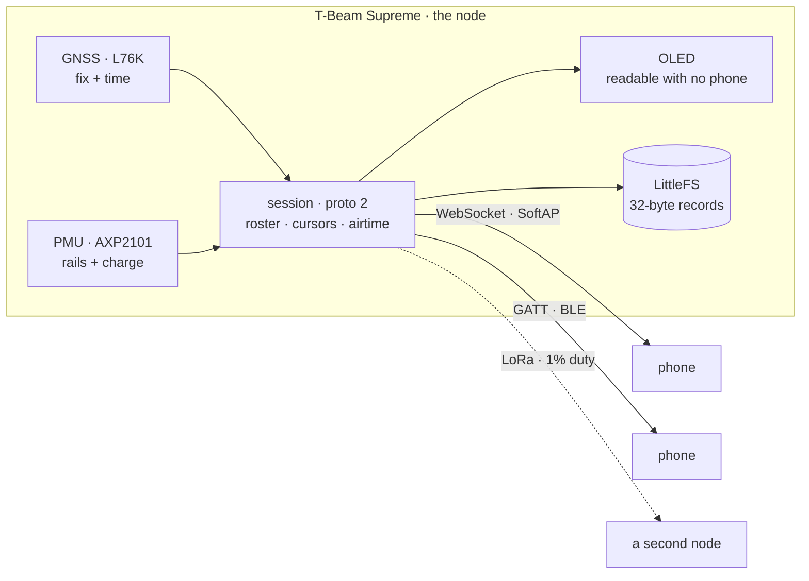

<h1 align="center">lokalgrid</h1>

<p align="center">
  <strong>A shared field node. One board serves live position, a map and chat to a group of phones — over its own WiFi and BLE.</strong><br>
  No internet. No server. No cell coverage. LoRa is the link <em>out</em> when WiFi range runs out.
</p>

<p align="center">
  
  
  
  
</p>

<p align="center">
  
  
  
  
  
</p>

<p align="center">
  
  
  
  <br>
  <sub>Boot · Live · Map · Chat. Captured against the mock node — map is Greenwich, peers are <code>alpha</code> and <code>bravo</code>.</sub>
</p>

---

Two properties define the build:

- **One radio, up to nine clients.** Airtime is arbitrated: priority lanes,
  deficit round-robin, a 1% duty cycle enforced in firmware, and queue state
  rendered as a reason — "queued 56 s, bravo ahead of you" — not a spinner.
- **Every position carries its uncertainty.** Accuracy ring from HDOP, dashed
  interpolated segments, age label on a stale fix. Never a crisp dot.

---

## The node

**LilyGO T-Beam Supreme** — ESP32-S3, SX1262 LoRa, L76K GNSS, AXP2101 PMU, 1.3"
OLED, BME280, PCF8563 RTC. ESP-IDF v5.3.1 firmware in `firmware/`.

<p align="center">
  <br>
  <sub>Mid-boot on the bench: <code>starting radios</code> on the OLED, and the band marking readable on the SX1262 module — which is where you check it.</sub>
</p>

**Radio:** never transmit without an antenna — the SX1262 PA is every damage
path. Set the band from your own regulator's table, not from this repo: check
the marking on the silkscreen beside the SMA connector, fit a whip that matches
it, and stay inside whatever is licence-free where you are. Nothing transmits
yet.

### Running today

| | |
|---|---|
| **GNSS** | Real fixes. GGA/RMC/GSA → 32-byte record: position, satellites, HDOP, altitude, speed, course, 2D/3D |
| **OLED** | Header badged with clients-against-cap, then ssid · wifi · ble (clients + MTU) · gnss (satellites + HDOP, or age of a lost fix) · power + uptime |
| **BLE** | GATT service, control + record characteristics in the §4 chunk framing |
| **WiFi** | SoftAP serving `proto 2` at `ws://192.168.4.1/ws` |
| **Storage** | LittleFS, single owning task |
| **PMU** | Rails read before write; ALDO4 is the GNSS rail and boots off |

`hello.mode` reports `gnss` or `synthetic`, so a demo track cannot pass as a
position.

### Board facts that contradict the datasheets

- **PSRAM is quad, not octal** — octal boot-loops.
- **Two I²C buses.** `i2c0` (sda 17 / scl 18): OLED, BME280, magnetometer.
  `i2c1` (sda 42 / scl 41): PMU, RTC.
- **No QMI8658 fitted** — motion gate falls back to GNSS speed.
- **BME280 is fitted**, not yet read; `baro` and `tmp` still write sentinels.
- **Runs from USB, not a cell** — no battery percentage, and the power ladder has
  nothing to measure.

### Verified on hardware

**Two handsets on the board at once — one over BLE, one over WiFi** — held in a
single roster that names each client's transport. Scan, connect, MTU
negotiation, subscribe, join, backlog, live records and chat all run end to end
against the real T-Beam on both wires.

Open: a USB-JTAG breakpoint, and reading the BME280.

---

## The app

Native **Android** — Kotlin + Compose, in `android/`. Five tabs: **Live · Map ·
Chat · Clients · Config**; Diagnostics behind a long-press on the title.

- Live dot with accuracy ring on a MapLibre map, everyone at once
- One shared chat channel, with a lane-0 emergency
- Phone's own GNSS behind "share my position", node's fix as a *labelled* fallback
- Per-client cursors with backlog resume; roster and rename
- Staged-then-explicit config writes
- Two basemaps, explicit offline download stating tile count and size first
- Sockets pinned to the WiFi `Network`; bounded-backoff reconnect
- BLE transport carrying the same session as the WebSocket

Nothing is gated behind a live connection — every tab stays readable offline and
reconnecting resumes from the cursor.

<p align="center">
  
  
  
  <br>
  <sub>Clients · Config · Diagnostics · Setup. All twelve screens in <a href="docs/screens">docs/screens/</a>.</sub>
</p>

---

## How it works



**Ownership rule.** The node is authoritative about *what exists* — seq, roster,
admission. Each client is authoritative about *what it has received* — its
cursor. Neither infers the other's state; it asks.

**One protocol, two transports.** `proto 2` lives once in
`firmware/main/session.c` behind a transport interface; the WebSocket and BLE
GATT adapters are thin. One roster, one cap of nine, and the roster names each
client's transport.

### Airtime

Three phones at 1 Hz already saturate ~1 kbit/s, so the scheduler is the normal
case, not an optimisation.

```
0  emergency   pre-empts everything, ignores fairness
1  position    aggregated, decimated by distance — 50 m default, not by time
2  message     deficit round-robin across clients
3  bulk        only when the budget is otherwise idle
```

Each client gets 1/N of what lanes 0 and 1 leave. Unused allocation **decays
rather than banks**, so an absent client cannot hoard and then flood. Admission
control refuses at enqueue with a reason computed from the order the queue will
actually transmit in — one service loop feeds both the plan and the transmit, so
the UI cannot drift from the scheduler.

A reason names its constraint. "queued 60 s" is a spinner with a number on it;
"queued 60 s — radio duty-cycled" or "bravo ahead of you" is an answer.

### Degradation

| Condition | Behaviour |
|---|---|
| 10th client connects | Refused with a reason, then closed — *node full — 9 of 9 clients*. The cap is NimBLE's ceiling. |
| Relay queue full | Refused at enqueue, naming the depth and the duty cycle. Never silently dropped. |
| Position barely moved | Skipped, with the distance that caused it — a silent skip looks like a dead GPS. |
| Battery below threshold | The power ladder sheds a service and announces which, why, and how long the next rung lasts. |
| Records aged out of the log | The backlog frame states how many were lost; the app drops its stale track rather than joining two unrelated stretches. |

---

## Tech stack

| Layer | Technology |
|---|---|
| **MCU** | [ESP-IDF](https://docs.espressif.com/projects/esp-idf/) v5.3.1 + CMake directly, target `esp32s3` |
| **BLE** | [NimBLE](https://mynewt.apache.org/latest/network/) — GATT + GAP, `CONFIG_BT_NIMBLE_MAX_CONNECTIONS=9` |
| **Node storage** | [`esp_littlefs`](https://github.com/joltwallet/esp_littlefs) `^1.14` — the firmware's only external dependency |
| **Node web** | `esp_http_server` with `CONFIG_HTTPD_WS_SUPPORT` |
| **App** | [Kotlin](https://kotlinlang.org/) 2.0.21 + [Jetpack Compose](https://developer.android.com/compose), `arm64-v8a` + `x86_64` only |
| **Map** | [MapLibre Android](https://maplibre.org/) 11.11.0 — keyless raster sources, no API key, 16 KB page-aligned |
| **Mock node** | Node.js, serving the real protocol from a synthetic or replayed session |

Chosen but **not yet built**: the SX1262 driver ([RadioLib](https://github.com/jgromes/RadioLib) as an IDF component),
[Room](https://developer.android.com/training/data-storage/room) for the durable
copy on the phone, and node-served PMTiles. None of the three is a dependency in
the tree today.

---

## The wire

Positions are a **32-byte fixed-width little-endian record** — `offset = index * 32`.
The layout never shrinks per build; absent sensors write sentinels. Control —
hello, roster, chat, queue state, config, stats, refusals — is one JSON object
per text frame, both directions.

The codec is written three times (JS in the mock, Kotlin in the app, C on the
node) against a shared golden-vector fixture all three reproduce byte for byte.

**A session, start to finish:**

```
node → hello        {proto, deviceId, recordBytes, hz, mode, you:{id,name},
                     cap, duty, posOldest, posNewest, posHeld}
app  → cursor       {seq, posSeq}                  // what I already have
node → chat ×N                                     // message delta
node → config, peer ×N, roster, stats              // everything else
node → backlog      {from, to, count, lost, reason}// what I owe you
node → binary ×60, backlogChunk {cursor, remaining}
       …repeats, interleaved with live traffic…
node → backlogDone  {cursor, live}                 // adopt this cursor
node → binary …                                    // live records, 1 Hz
```

Backlog is served in bounded chunks — sixty records per 250 ms tick — so a
client returning after an hour catches up *beside* the live ones rather than
blocking them. The node states what it owes before sending it, including how
many records aged out, because a gap must be drawn as a gap.

Field table in [PROJECT.md §4](PROJECT.md); every control frame in
[the spec](docs/lokalgrid-master-plan.html); frame-by-frame in
[`mock-node/README.md`](mock-node/README.md).

---

## Run it

**Against the mock**, no hardware needed:

```bash
# 1. the fake node — synthetic track at 1 Hz, plus two wandering peers
cd mock-node && npm install && npm start -- --ghosts 2

# 2. the app, on an emulator (10.0.2.2 is its alias for your machine)
cd android && ./gradlew :app:installDebug
```

On a real phone, set the URL in the app's setup step to your machine's LAN IP —
`10.0.2.2` only resolves on an emulator.

**Against the board:**

```bash
cd firmware && idf.py -p /dev/cu.usbmodem* flash
```

Then either join the node's `lokalgrid` WiFi and point the app at
`ws://192.168.4.1/ws`, or leave the phone on its normal WiFi and use **BLE**:
status bar → Link → *Scan for nodes*. The node's AP has no internet behind it;
BLE carries the same session and costs you nothing.

> [!TIP]
> `cat /dev/cu.usbmodem*` returns **zero bytes**. The USB-Serial-JTAG console
> only emits once the host CDC looks connected, and the `cu.` device does not
> assert modem control. Open the port and assert DTR and RTS together.

Tests need neither device nor board:

```bash
cd mock-node     && npm test                  # codec, airtime queue, config, decimation
cd android       && ./gradlew :protocol:test  # the Kotlin half of the same codec
cd firmware/test && ./run.sh                  # the C half, against the same vectors
```

---

## License

**MIT** — see [`LICENSE`](LICENSE).

- Meshtastic firmware is **GPL**. This firmware is written from the protocol
  spec, not copied.
- The mock node ships a neutral default start position (Greenwich). Set `LAT0`
  and `LON0` to somewhere you know.

Issues and PRs welcome; personal build, no support commitment.
