<h1 align="center">lokalgrid</h1>

<p align="center">
  <strong>A modern walkie-talkie.</strong> Text and live position, for whoever is in range.<br>
  No internet. No server. No cell coverage. Text, not voice.
</p>

<p align="center">
  
  
  
  
</p>

<p align="center">
  
  
  
  
  
</p>

<p align="center">
  Started from <a href="https://meshtastic.org/">Meshtastic</a> — a mesh of nodes, a phone each.<br>
  I have one board, so this goes the other way: one node, many phones, one radio to share.<br>
  <sub>Written from the protocol spec, not forked — no Meshtastic code here.</sub>
</p>

> [!IMPORTANT]
> **Weekend hobby project, early-stage prototype.** Built to play with the
> protocol, not for real-world use. No support, no guarantees — use at your own
> risk.

<p align="center">
  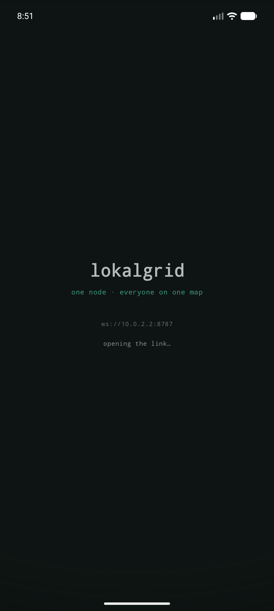
  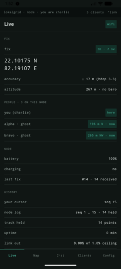
  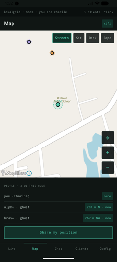
  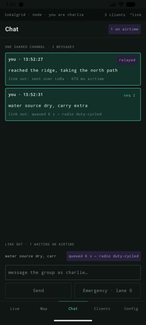<br>
  <sub>Boot · Live · Map · Chat. Captured against the mock node — map is Greenwich, peers are <code>alpha</code> and <code>bravo</code>.</sub>
</p>

---

- **One radio, up to nine clients.** Airtime is arbitrated across priority lanes
  by deficit round-robin, at a 1% duty cycle enforced in firmware. Queue state
  is rendered as a reason: *"queued 56 s, bravo ahead of you"*.
- **Every position carries its uncertainty.** Accuracy ring from HDOP, dashed
  interpolated segments, age label on a stale fix.

---

## Node

**LilyGO T-Beam Supreme** — ESP32-S3, SX1262 LoRa, L76K GNSS, AXP2101 PMU, 1.3"
OLED, BME280, PCF8563 RTC. ESP-IDF v5.3.1 firmware in `firmware/`.

<p align="center">
  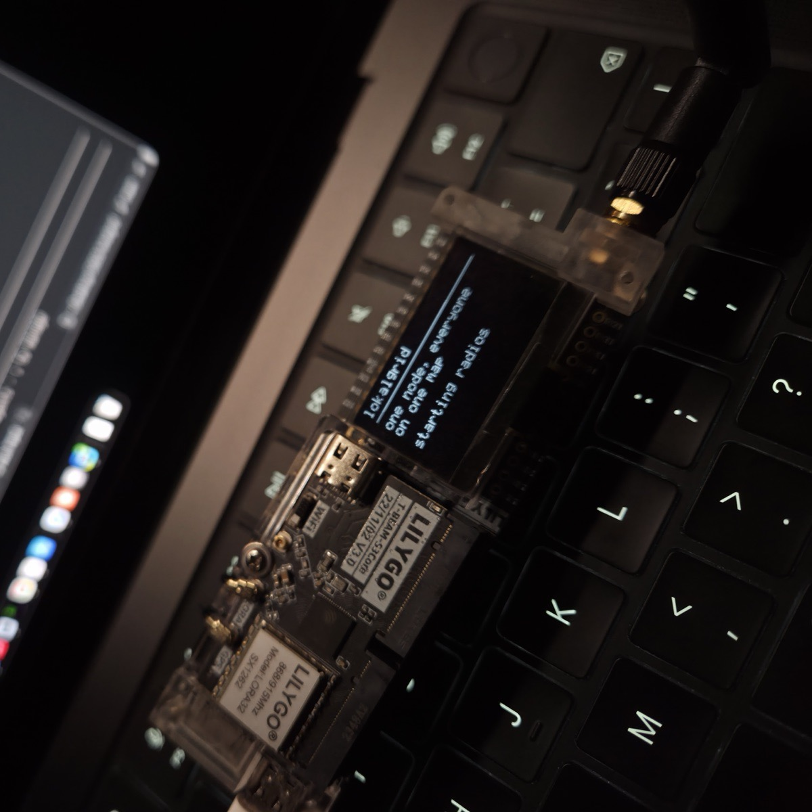
  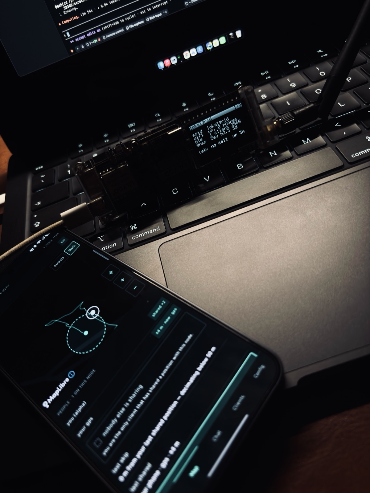<br>
  <sub>Left: mid-boot, <code>starting radios</code> on the OLED, band marking readable on the SX1262 module.<br>
  Right: up and serving — <code>ssid lokalgrid</code> and <code>usb, no cell</code> on the OLED, the Map screen and its accuracy ring on the phone.</sub>
</p>

**Radio:** never transmit without an antenna — the SX1262 PA is every damage
path. Set the band from your own regulator's table, not from this repo: check
the marking on the silkscreen beside the SMA connector, fit a matching whip, and
stay inside whatever is licence-free where you are. Nothing transmits yet.

### On the board

Two I²C buses, not one — the split that took a scan to find. Everything below is
verified on this unit.

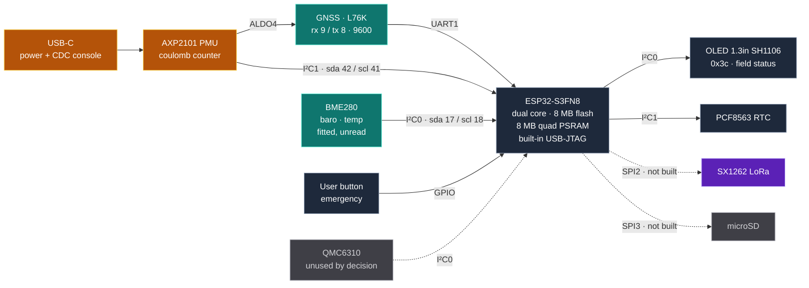

<sub>■ sensing ■ radio ■ power ■ core · dashed = present but not driven yet</sub>

The SX1262 and the microSD stay on **separate SPI buses** — sharing one gives
corrupt writes that only appear when a beacon fires mid-write.

### Running today

| | |
|---|---|
| **GNSS** | Real fixes. GGA/RMC/GSA → 32-byte record: position, satellites, HDOP, altitude, speed, course, 2D/3D |
| **OLED** | Header badged with clients-against-cap, then ssid · wifi · ble (clients + MTU) · gnss (satellites + HDOP, or age of a lost fix) · power + uptime |
| **BLE** | GATT service, control + record characteristics in the §4 chunk framing |
| **WiFi** | SoftAP serving `proto 2` at `ws://192.168.4.1/ws` |
| **Storage** | LittleFS, single owning task |
| **PMU** | Rails read before write; ALDO4 is the GNSS rail, off at power-up |

`hello.mode` reports `gnss` or `synthetic`, so clients can tell a real fix from
a demo track.

### Verified on hardware

**Two handsets on the board at once — one over BLE, one over WiFi** — held in a
single roster that names each client's transport. Scan, connect, MTU
negotiation, subscribe, join, backlog, live records and chat all run end to end
against the real T-Beam on both wires.

Open: a USB-JTAG breakpoint and reading the BME280.

---

## App

Native **Android** — Kotlin + Compose, in `android/`. Every tab sends something,
and every action gets a node-authored answer.

### Working today

| Tab | You do | Node answers |
|---|---|---|
| **Live** | share position · rename · reset track | peer fan-out or a skip reason; new roster; fresh track |
| **Map** | share position | your dot and everyone else's, each with its ring and age |
| **Chat** | send · send as emergency (lane 0) | `seq` echo, then live queue state until `relayed` |
| **Clients** | rename on the roster | roster with per-client airtime meters, duty used, queue depth |
| **Config** | stage edits, write explicitly | applied and refused, key by key, with reasons |
| **Link** *(tap the status bar)* | grant permissions, reconnect, change node | an ordered flow: permissions · wifi · ble · session |

Also working:

- **Either transport, chosen at runtime** — WebSocket over the node's SoftAP, or
  BLE GATT. Same session either way; the choice survives a restart.
- **Resume, not restart** — a position cursor per node, stated on every connect,
  so reopening after an hour fetches a delta. Recovered history draws as a track
  line.
- **Offline throughout** — nothing is gated behind a live connection. Every tab
  stays readable with the node unreachable.
- **Phone's own GNSS** behind "share my position", with the node's fix as a
  *labelled* fallback.
- **Two basemaps** with a user-initiated offline download that states tile count
  and size first.
- **Sockets pinned to the WiFi `Network`**, bounded-backoff reconnect, immediate
  retry when WiFi changes.
- **Diagnostics** behind a long-press on the title.

Not built yet: the foreground sync service, and Room for the durable track (the
cursor persists, the history is still in memory).

**Android only. iOS is not supported and not planned.** The codec and control
frames do sit apart in `:protocol`, a plain Kotlin module with no Android
dependency, so the shareable half is already separated — but it is a JVM module
leaning on `java.nio.ByteBuffer` and `java.util.zip.CRC32`, so Kotlin
Multiplatform would be a port, not a switch.

<p align="center">
  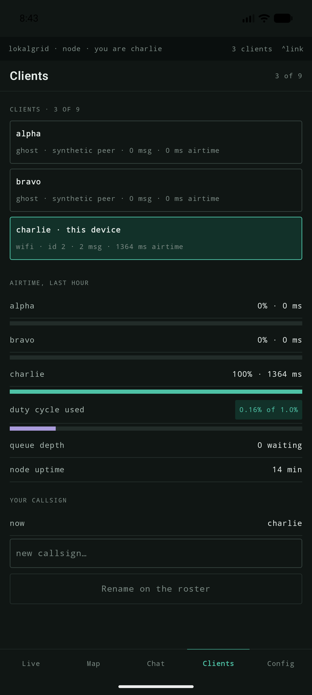
  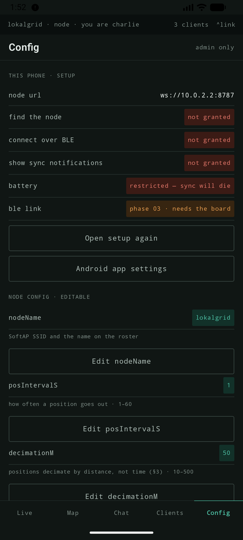
  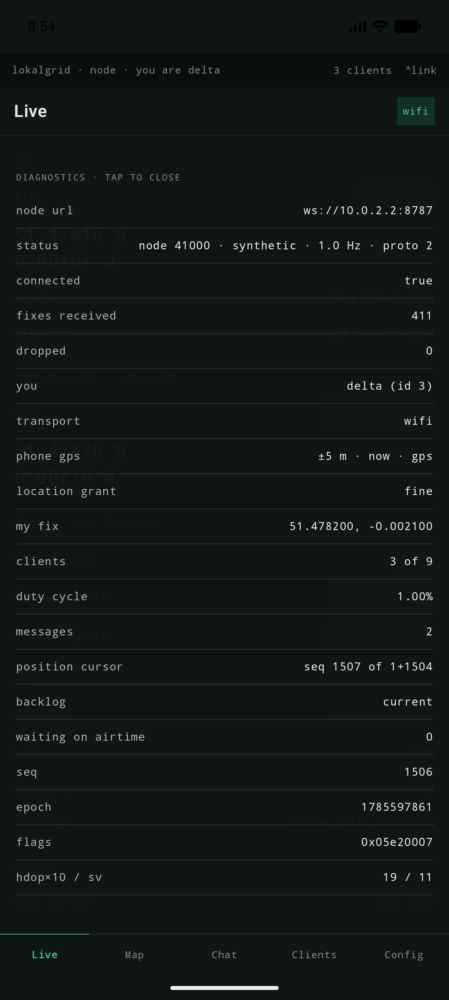
  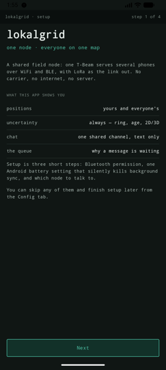<br>
  <sub>Clients · Config · Diagnostics · Setup. All twelve screens in <a href="docs/screens">docs/screens/</a>.</sub>
</p>

---

## How it works

Fix and power in on the left, clients out on the right. One session in the
middle owns the roster, the cursors and the airtime budget.

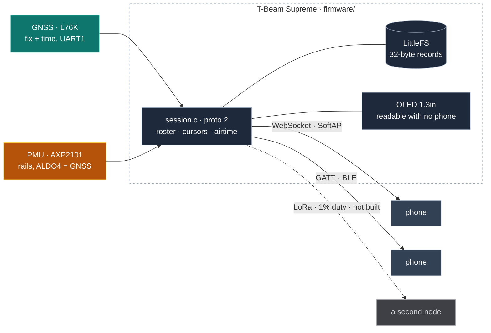

The node is authoritative about *what exists* — seq, roster, admission. Each
client is authoritative about *what it has received* — its cursor.

`proto 2` lives once in `firmware/main/session.c` behind a transport interface;
the WebSocket and BLE GATT adapters are thin. One roster, one cap of nine, and
the roster names each client's transport.

### Airtime

Three phones at 1 Hz saturate ~1 kbit/s. Four priority lanes:

```
0  emergency   pre-empts everything, ignores fairness
1  position    aggregated, decimated by distance — 50 m default, not by time
2  message     deficit round-robin across clients
3  bulk        only when the budget is otherwise idle
```

Each client gets 1/N of what lanes 0 and 1 leave; unused allocation decays
rather than banks. Admission control refuses at enqueue with a reason computed
from the order the queue will actually transmit in — one service loop feeds both
the plan and the transmit.

### Degradation

| Condition | Behaviour |
|---|---|
| 10th client connects | Refused with a reason, then closed — *node full — 9 of 9 clients* |
| Relay queue full | Refused at enqueue, naming the depth and the duty cycle |
| Position barely moved | Skipped, with the distance that caused it |
| Battery below threshold | The power ladder sheds a service and announces which, why, and how long the next rung lasts |
| Records aged out of the log | The backlog frame states how many were lost; the app drops its stale track |

---

## Tech stack

| Layer | Technology |
|---|---|
| **MCU** | [ESP-IDF](https://docs.espressif.com/projects/esp-idf/) v5.3.1 + CMake directly, target `esp32s3` |
| **BLE** | [NimBLE](https://mynewt.apache.org/latest/network/) — GATT + GAP, `CONFIG_BT_NIMBLE_MAX_CONNECTIONS=9` |
| **Node storage** | [`esp_littlefs`](https://github.com/joltwallet/esp_littlefs) `^1.14` — firmware's only external dependency |
| **Node web** | `esp_http_server` with `CONFIG_HTTPD_WS_SUPPORT` |
| **App** | [Kotlin](https://kotlinlang.org/) 2.0.21 + [Jetpack Compose](https://developer.android.com/compose), `arm64-v8a` + `x86_64` only |
| **Map** | [MapLibre Android](https://maplibre.org/) 11.11.0 — keyless raster sources, no API key, 16 KB page-aligned |
| **Mock node** | Node.js, serving the real protocol from a synthetic or replayed session |

**Not built yet**, and not dependencies in the tree today: the SX1262 driver
([RadioLib](https://github.com/jgromes/RadioLib)),
[Room](https://developer.android.com/training/data-storage/room) for the
durable copy on the phone, and node-served PMTiles.

---

## Wire

Positions are **32-byte fixed-width little-endian records** — `offset = index * 32`.
The layout never shrinks per build; absent sensors write sentinels. Control —
hello, roster, chat, queue state, config, stats, refusals — is one JSON object
per text frame, both directions.

The codec is written three times — JS in the mock, Kotlin in the app, C on the
node — against a shared golden-vector fixture all three reproduce byte for byte.

**A session, start to finish:**

```
node → hello        {proto, deviceId, recordBytes, hz, mode, you:{id,name},
                     cap, duty, posOldest, posNewest, posHeld}
app  → cursor       {seq, posSeq}                  // what I already have
node → chat ×N                                     // message delta
node → config, peer ×N, roster, stats              // everything else
node → backlog      {from, to, count, lost, reason}// what I owe you
node → binary ×60, backlogChunk {cursor, remaining}
       …repeats, interleaved with live traffic…
node → backlogDone  {cursor, live}                 // adopt this cursor
node → binary …                                    // live records, 1 Hz
```

Backlog is served in bounded chunks — sixty records per 250 ms tick — interleaved
with live traffic. The node states what it owes before sending it, including how
many records aged out.

Field table in [PROJECT.md §4](PROJECT.md); every control frame in
[the spec](docs/lokalgrid-master-plan.html); frame-by-frame in
[`mock-node/README.md`](mock-node/README.md).

---

## Run it

**Against the mock**, no hardware needed:

```bash
# 1. the fake node — synthetic track at 1 Hz, plus two wandering peers
cd mock-node && npm install && npm start -- --ghosts 2

# 2. the app, on an emulator (10.0.2.2 is its alias for your machine)
cd android && ./gradlew :app:installDebug
```

On a real phone, set the URL in the app's setup step to your machine's LAN IP —
`10.0.2.2` only resolves on an emulator.

**Against the board:**

```bash
cd firmware && idf.py -p /dev/cu.usbmodem* flash
```

Then either join the node's `lokalgrid` WiFi and point the app at
`ws://192.168.4.1/ws`, or leave the phone on its normal WiFi and use **BLE**:
status bar → Link → *Scan for nodes*. Both carry the same session.

> [!TIP]
> `cat /dev/cu.usbmodem*` returns **zero bytes**. The USB-Serial-JTAG console
> only emits once the host CDC looks connected, and the `cu.` device does not
> assert modem control. Open the port and assert DTR and RTS together.

Tests need neither device nor board:

```bash
cd mock-node     && npm test                  # codec, airtime queue, config, decimation
cd android       && ./gradlew :protocol:test  # the Kotlin half of the same codec
cd firmware/test && ./run.sh                  # the C half, against the same vectors
```

---

## License

**MIT** — see [`LICENSE`](LICENSE).

---

<p align="center">
  <sub>Built with <a href="https://claude.com/claude-code">Claude Code</a> — firmware, app, mock node, protocol and docs alike.</sub>
</p>
